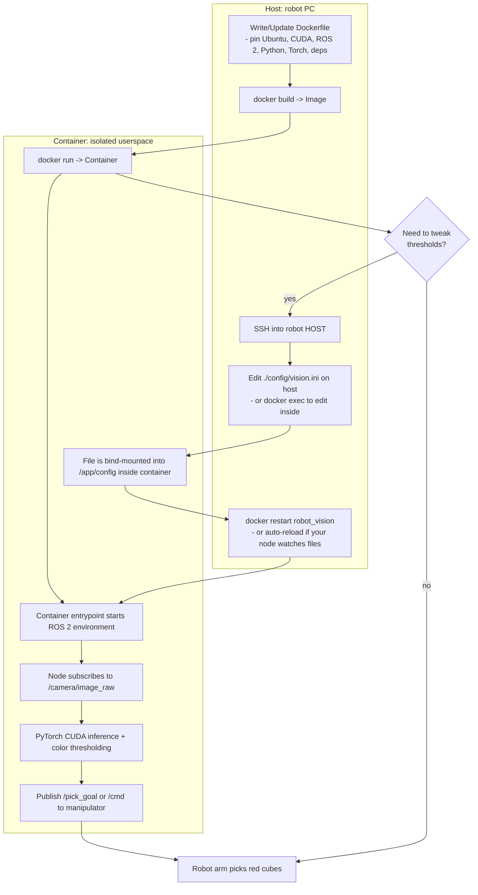

# Docker

Docker is a platform that enables developers to package applications and their dependencies into isolated units called containers. These containers can run reliably across different environments, making Docker an essential tool in modern robotics and engineering workflows, particularly for deployment, simulation, and CI/CD.

---

## 📚 Overview

Docker uses lightweight containerization to bundle software, libraries, configurations, and environments. In robotics, Docker simplifies reproducibility, multi-platform development, and cross-compilation—especially when working with complex stacks like ROS, computer vision, or simulation environments.

---

## 🧠 Core Concepts

- **[[Docker Image]]**: A snapshot of a container environment (OS + dependencies + app).
- **[[Docker Container]]**: A running instance of an image.
- **[[Dockerfile]]**: Script that defines how an image is built.
- **[[Docker Volumes]]**: Mounted file paths for persistent or shared data.
- **[[Docker Networks]]**: Virtualized networking between containers.
- **[[Docker Registry]]**: Repository for storing and sharing Docker images (e.g., Docker Hub).

---

## 🧰 Use Cases

- Running ROS1/ROS2 without polluting the host system
- Building cross-platform ARM/AMD64 environments
- Creating reproducible CI test environments
- Isolating simulation tools like Gazebo or Webots
- Packaging web servers, ML models, or REST APIs for robotic systems

---

## ✅ Pros

- Environment consistency across machines
- Fast and lightweight compared to full VMs
- Easy version control for environments
- Works across cloud and edge devices
- Encourages modular system design

---

## ❌ Cons

- Learning curve for Dockerfiles and container management
- Requires root or special permissions for low-level hardware access
- GPU and USB access needs extra configuration
- Less performant than native execution in some edge cases

---

## 📊 Comparison Chart

| Feature               | Docker                  | [[Virtual Machine]]         | [[Conda]]/[[venv]]           | System Install        |
|-----------------------|-------------------------|--------------------------|----------------------|------------------------|
| **Isolation**         | ✅ High                 | ✅ Full                 | ⚠️ Medium           | ❌ None               |
| **Performance**       | ✅ Near-native           | ❌ Heavy overhead        | ✅ Native            | ✅ Native              |
| **Reproducibility**   | ✅ Excellent             | ✅ Excellent             | ⚠️ Partial           | ❌ Poor               |
| **Ease of Sharing**   | ✅ Docker Hub            | ⚠️ Complex              | ⚠️ Depends           | ❌ Manual             |
| **Setup Time**        | ⚠️ Medium               | ❌ High                 | ✅ Fast              | ✅ Fast                |

---

## 🤖 Comparison: Docker vs Kubernetes

| Feature                     | Docker                              | [[Kubernetes]]                                  |
|-----------------------------|--------------------------------------|---------------------------------------------|
| **Type**                    | Container engine                     | Container orchestration system              |
| **Use Case**                | Local development, small deployments | Production, multi-node orchestration        |
| **Complexity**              | ✅ Simple                            | ❌ Complex                                  |
| **Scalability**             | ❌ Limited to host                   | ✅ High (multi-node, cloud-native)          |
| **Networking**              | Local bridge or host networking      | Full virtual network across clusters        |
| **Service Discovery**       | ❌ Manual                            | ✅ Built-in with DNS                        |
| **Auto-restart / Healing**  | ⚠️ Basic with `--restart` flags     | ✅ Fully automatic with health checks       |
| **GUI/Tooling**             | ✅ Docker Desktop, Portainer         | ✅ Dashboards, Helm, kubeadm, kubectl       |
| **Common in Robotics**      | ✅ Yes                               | ⚠️ Increasing (e.g., in cloud/edge robotics)|
| **Best For**                | Dev environments, CI/CD, local tests | Production-grade robotic fleets or cloud AI |

---

---

## 🔧 Compatible Items

- `docker`, `docker-compose`
- `nvidia-docker2` or `--gpus all` for GPU support
- Dockerfiles in ROS2 packages or CI/CD pipelines
- [[ROS2]], [[Gazebo]], [[TensorRT]], [[OpenCV]]
- [[VSCode Dev Containers]]
- [[GitHub Actions]] (runs Docker containers in workflows)

---

## 🔗 Related Concepts

- [[ROS2]] (Often containerized for testing and deployment)
- [[VSCode Dev Containers]] (Use Docker to provide local dev environments)
- [[CI-CD]] (Use Docker for reproducible builds)
- [[Podman]] (Docker alternative with rootless support)
- [[Jetson Family]] (Requires special containers for hardware acceleration)
- [[Kubernetes]]

---

## 🛠 Developer Tools

- `docker build`, `docker run`, `docker ps`, `docker exec`
- `docker-compose` for multi-container orchestration
- Docker Hub, GitHub Container Registry (GHCR)
- VSCode Remote Containers for development
- Bind mounts and volumes for sharing data with host

---

## 📚 Further Reading

- [Docker Official Documentation](https://docs.docker.com/)
- [Using Docker with ROS2](https://docs.ros.org/en/foxy/How-To-Guides/Working-with-Docker.html)
- [Best Practices for Dockerfiles](https://docs.docker.com/develop/develop-images/dockerfile_best-practices/)
- [NVIDIA Container Toolkit](https://docs.nvidia.com/datacenter/cloud-native/container-toolkit/)

---
